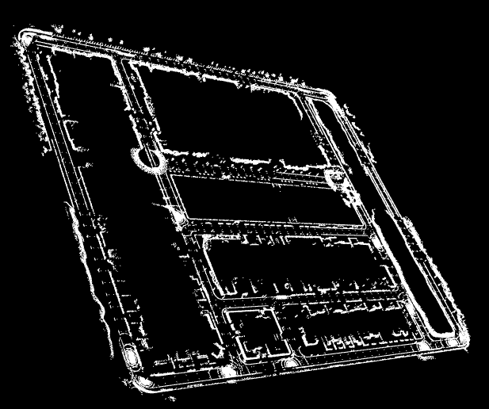

# Map Saver for CARLA Simulator

The utility program saves OpenDRIVE .xodr and point cloud .pcd
files from the CARLA simulator.



## Usage

To save the `Town01` map from CARLA,

```bash
cargo run --release -- -w Town01 map.xodr map.pcd
```

## License

This work is distributed under MIT license. Please check the [license file](LICENSE.txt).
